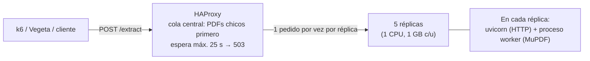

# Microservicio PDF → Markdown bajo carga

Trabajo práctico de **Desarrollo de Software** (UTN FRSR): un microservicio que
recibe un PDF y devuelve su texto en Markdown, optimizado para soportar pruebas
de carga y estrés con **Grafana k6** y **Vegeta**.

```http
POST /extract
Content-Type: application/pdf          (o multipart/form-data)

200 OK
{"content": "# Título\n\nTexto del documento...", "page_count": 292}
```

- 5 réplicas de 1 CPU / 1 GB detrás de **HAProxy**, con una cola central que
  descarta con `503` lo que no se va a poder atender a tiempo.
- Extracción con **MuPDF** y un conversor a Markdown propio: 300 veces más
  rápido que pymupdf4llm sobre los PDFs de prueba.
- Informe técnico completo: [`docs/INFORME.md`](docs/INFORME.md).

## Inicio rápido

Requisito: [Docker Desktop](https://www.docker.com/products/docker-desktop/) (o Docker Engine + Compose v2).

```bash
docker compose up --build
```

Con eso quedan levantados la API en <http://localhost:8080/extract> y el panel
de HAProxy en <http://localhost:8404>. Para probarla:

```bash
curl -H "Content-Type: application/pdf" --data-binary @tests/stress/pdfs/2020-Scrum-Guide-Spanish-Latin-South-American.pdf http://localhost:8080/extract
```

```bash
curl -F "file=@tests/stress/pdfs/2020-Scrum-Guide-Spanish-Latin-South-American.pdf" http://localhost:8080/extract
```

## Pruebas de carga

Con el sistema levantado, en otra terminal:

```bash
docker compose --profile stress run --rm k6
```

```bash
docker compose --profile stress run --rm vegeta
```

```bash
python scripts/compare_results.py
```

| Prueba | Perfil (consigna) | Script |
|---|---|---|
| Spike (modelo cerrado) | 0→100 VUs en 10 s, 20 s a 100, 100→0 en 10 s | `tests/stress/k6/spike.js` |
| Carga fija (modelo abierto) | 50 req/s durante 30 s, timeout 30 s, rotando los PDFs | `tests/stress/vegeta/run.sh` |

k6 imprime al final una tabla comparada con el benchmark del profesor (y sus
umbrales marcan ✓/✗). Los resultados quedan en `tests/stress/results/`.
`compare_results.py` arma las mismas tablas para ambas pruebas, también en
Markdown (`--markdown`) para pegarlas en el informe.

Variantes útiles: `-e UPLOAD_MODE=multipart` en k6 (por defecto manda el PDF
en binario, como el script del profesor) y `-e RATE=30` en Vegeta.

## Arquitectura



Las decisiones y sus alternativas están en `docs/adr/`:

| ADR | Decisión |
|---|---|
| [0001](docs/adr/0001-motor-de-extraccion.md) | MuPDF + conversor propio a Markdown (medido contra 7 alternativas) |
| [0002](docs/adr/0002-balanceo-y-backpressure.md) | HAProxy con cola central acotada en tiempo |
| [0003](docs/adr/0003-proceso-http-y-pool-de-workers.md) | HTTP en el event loop, extracción en un proceso aparte |
| [0004](docs/adr/0004-lenguaje-y-framework.md) | Python 3.13 + Starlette + Uvicorn |

## Configuración

Todo se configura con variables de entorno y tiene un valor por defecto, así
que no hace falta ningún archivo. Para probar variantes, copiar `.env.example`
como `.env`.

| Variable | Defecto | Qué controla |
|---|---|---|
| `REPLICAS` | `5` | Réplicas del microservicio (máximo 5) |
| `EXTRACTION_WORKERS` | `1` | Procesos que extraen dentro de cada réplica |
| `MAX_QUEUE_SIZE` | `8` | Pedidos que pueden esperar dentro de una réplica |
| `QUEUE_TIMEOUT_SECONDS` | `25` | Espera máxima dentro de una réplica antes del 503 |
| `MAX_UPLOAD_MB` | `32` | Tamaño máximo del PDF (413 si se supera) |
| `UPLOAD_TIMEOUT_SECONDS` | `15` | Tiempo máximo para recibir el PDF (408 si se supera) |
| `LOG_LEVEL` | `INFO` | `DEBUG`, `INFO`, `WARNING` o `ERROR` |
| `HAPROXY_SERVER_MAXCONN` | `1` | Pedidos simultáneos por réplica |
| `HAPROXY_QUEUE_TIMEOUT` | `25s` | Espera máxima en la cola central antes del 503 |
| `HAPROXY_MAX_QUEUE` | `1000` | Largo de cola a partir del cual se rechaza en el momento |
| `HAPROXY_SMALL_PDF_BYTES` | `1048576` | PDFs de menos de 1 MB salen primero de la cola (0 = FIFO pura) |

## Errores

Todas las respuestas de error tienen la misma forma:
`{"error": {"code": "...", "message": "..."}}`.

| HTTP | `code` | Cuándo |
|---|---|---|
| 400 | `EMPTY_BODY`, `INVALID_MULTIPART` | Pedido vacío o multipart mal formado |
| 413 | `PAYLOAD_TOO_LARGE` | El PDF supera `MAX_UPLOAD_MB` |
| 408 | `REQUEST_TIMEOUT` | El PDF no terminó de llegar en `UPLOAD_TIMEOUT_SECONDS` |
| 422 | `INVALID_PDF` | No es un PDF, está dañado o tiene contraseña |
| 500 | `WORKER_CRASHED`, `INTERNAL_ERROR` | Falla interna |
| 503 | `SERVICE_OVERLOADED` | Backpressure: cola llena o espera vencida (con `Retry-After`) |

## Desarrollo sin Docker

```bash
python -m venv .venv
```

```bash
.venv/Scripts/pip install -r requirements-dev.txt
```

| Comando | Para qué |
|---|---|
| `python -m pytest` | Tests unitarios y de integración |
| `python -m ruff check . && python -m ruff format --check .` | Lint y formato |
| `PYTHONPATH=src python -m pdf_extractor` | Levantar el servicio local (puerto 8000) |
| `python scripts/generate_test_pdfs.py` | Regenerar los 4 PDFs de prueba sustitutos |
| `python scripts/benchmark_extractors.py` | Comparar motores de extracción |
| `python scripts/simulate_queues.py` | Simular k6 y Vegeta sobre distintas arquitecturas |
| `python scripts/make_charts.py` | Regenerar los gráficos del informe |

En Linux/macOS, el ejecutable del entorno virtual está en `.venv/bin/` en lugar de `.venv/Scripts/`.

## Estructura

```
src/pdf_extractor/      Microservicio
  api/                  Rutas, lectura del upload, errores, log de acceso
  extraction/           PDF → líneas con estilo (MuPDF) → Markdown
  concurrency/          Pool de procesos y control de admisión
  config.py, logs.py    Configuración por entorno y logs JSON
  worker_tasks.py       Lo que corre dentro de cada proceso worker
proxy/haproxy.cfg       Balanceo, cola central y backpressure
tests/unit/             Tests de lógica (rápidos)
tests/integration/      Tests de la API con el pool de procesos real
tests/stress/           k6, Vegeta, PDFs de prueba y resultados
scripts/                PDFs de prueba, benchmarks, simulación, gráficos
docs/                   Informe, ADRs y datos de investigación
```

## PDFs de prueba

`tests/stress/pdfs` tiene los 4 PDFs oficiales de la cátedra (ver
[`tests/stress/pdfs/README.md`](tests/stress/pdfs/README.md)). Los scripts de
k6 y Vegeta toman todos los `*.pdf` de esa carpeta.

## Equipo

Grupo: Maxi, Rami, Facu, Lucas y Juani. Cómo trabajamos con git:
[`CONTRIBUTING.md`](CONTRIBUTING.md).
