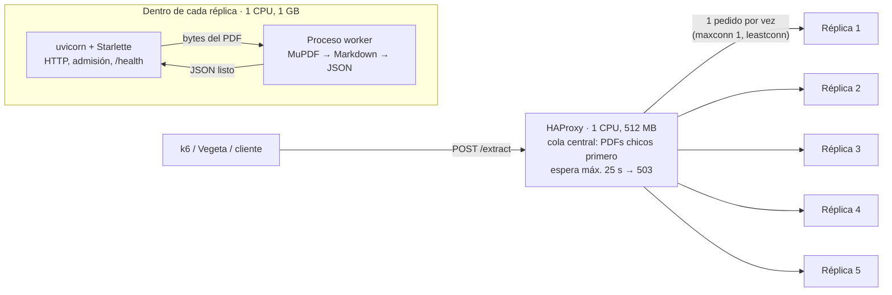
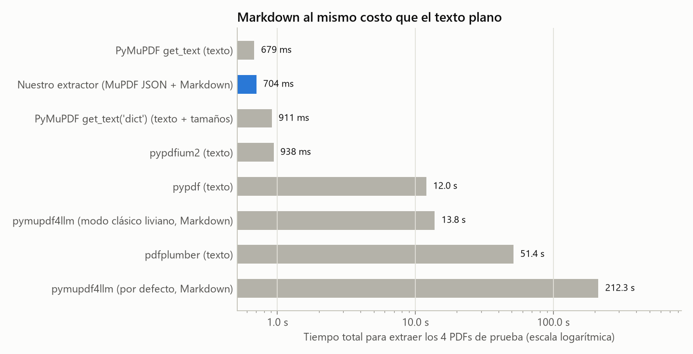
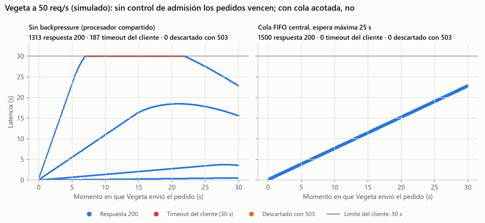

# Informe técnico — Test de carga, estrés y optimización de microservicio

**Materia:** Desarrollo de Software · UTN Facultad Regional San Rafael
**Grupo:** Maxi, Rami, Facu, Lucas y Juani
**Repositorio:** este mismo (`docker compose up --build` levanta todo)

---

## 1. Resumen

Construimos un microservicio que recibe un PDF por `POST /extract` y devuelve
su contenido en Markdown junto con la cantidad de páginas. El sistema corre en
Docker con 5 réplicas de 1 CPU y 1 GB detrás de HAProxy.

Tres decisiones explican el rendimiento:

1. **Motor de extracción:** MuPDF con un conversor a Markdown propio. Extrae
   los 4 PDFs de prueba en 0,70 s; la librería "estándar" para Markdown
   (pymupdf4llm) tarda 212 s (sección 4.1).
2. **Separación HTTP / CPU:** cada réplica atiende HTTP en un event loop y
   extrae en un proceso aparte, así nunca deja de responder (sección 3).
3. **Cola central acotada en tiempo y con prioridad:** HAProxy le da a cada
   réplica un PDF por vez y hace esperar al resto en una sola cola, donde los
   PDFs chicos pasan primero. Ningún pedido espera más de 25 s: si no llega,
   recibe un 503 explícito antes del timeout del cliente (secciones 4.4 y 4.5).

**Resultado en Docker con los PDFs oficiales de la cátedra** (sección 6.3):

- **Vegeta:** 98,5–100 % de éxito (el profesor, 66,53 %), 0 timeouts (501),
  26,8–28,1 req/s efectivos (16,65) y mediana de 0,6–1,4 s (14,89 s).
- **k6:** mediana de 3 corridas de 25,45 req/s (25,35), 0 % de error, p50 de
  0,77 s (1,88 s), p95 de 8,06 s (8,80 s) y máximo de 8,41 s (13,94 s). El p90
  queda prácticamente igual (7,95 contra 7,83 s).

---

## 2. Requerimientos y cómo se cumplen

| Requerimiento (consigna) | Cómo lo cumplimos | Dónde |
|---|---|---|
| `POST /extract` | Ruta Starlette | `src/pdf_extractor/api/routes.py` |
| PDF por multipart **o** binario directo | Se aceptan los dos, con cualquier nombre de campo | `api/uploads.py` |
| `200` + `application/json` con `content` y `page_count` | El worker serializa exactamente esas dos claves | `worker_tasks.py` |
| Contenido en Markdown | Títulos, listas, negritas y párrafos | `extraction/markdown.py` |
| Imagen Docker + `docker compose` | Un solo comando: `docker compose up --build` | `Dockerfile`, `docker-compose.yml` |
| Hasta 5 réplicas con balanceo | `deploy.replicas: 5` + HAProxy | `docker-compose.yml`, `proxy/haproxy.cfg` |
| Límites explícitos por contenedor | Réplicas: 1,0 CPU y 1 GB; proxy: 1,0 CPU y 512 MB | `docker-compose.yml` |
| PDFs de `tests/stress/pdfs` | Los scripts toman todos los `*.pdf` de esa carpeta | `tests/stress/` |
| Script k6 spike (0→100 VUs en 10 s, 20 s, 100→0 en 10 s) | `ramping-vus` con esas etapas | `tests/stress/k6/spike.js` |
| Script Vegeta (50 req/s, 30 s, 4 PDFs, timeout 30 s) | `vegeta attack` con esos parámetros | `tests/stress/vegeta/run.sh` |
| Backpressure con 429/503 | 503 + `Retry-After` en la réplica y en el balanceador | `concurrency/admission.py`, `haproxy.cfg` |
| Twelve-Factor | Ver sección 7 | — |

---

## 3. Arquitectura



### 3.1 Recorrido de un pedido

1. HAProxy recibe el pedido. Si alguna réplica está libre, se lo pasa; si no,
   lo pone en la **cola central** (los PDFs de menos de 1 MB, adelante). Si espera más de 25 s, responde
   `503 SERVICE_OVERLOADED` con `Retry-After: 2` sin haberlo procesado.
2. La réplica lee el cuerpo (con un límite de 32 MB), detecta si es multipart
   o binario y verifica la firma `%PDF-`. Todo en memoria, sin archivos
   temporales.
3. El **control de admisión** de la réplica le da un lugar en el worker. Es la
   segunda línea de defensa, por si alguien le pega directo a la réplica sin
   pasar por el proxy.
4. El **worker** (otro proceso) abre el PDF sobre esos mismos bytes, extrae las
   líneas con su estilo, arma el Markdown y serializa el JSON.
5. La réplica devuelve el JSON tal cual, con un encabezado `Server-Timing` que
   separa la espera en cola del tiempo de extracción, y escribe una línea de
   log JSON con esos datos.

### 3.2 Módulos

| Módulo | Responsabilidad | Conoce a |
|---|---|---|
| `extraction/reader.py` | PDF → líneas con tamaño de letra y negrita (único que usa MuPDF) | MuPDF |
| `extraction/markdown.py` | Líneas → Markdown (lógica pura) | — |
| `concurrency/worker_pool.py` | Pool de procesos con recuperación si un worker muere | — |
| `concurrency/admission.py` | Cola acotada en tamaño y tiempo | — |
| `worker_tasks.py` | Lo que corre dentro del worker | extraction |
| `api/` | Rutas, lectura del upload, formato de errores, log de acceso | concurrency, worker_tasks |
| `config.py`, `logs.py` | Configuración por entorno y logs JSON | — |

Las dependencias van en un solo sentido (api → concurrency/worker_tasks →
extraction), así cada capa se testea por separado.

Las decisiones están documentadas como ADR en `docs/adr/`:

- [ADR-0001](adr/0001-motor-de-extraccion.md): motor de extracción.
- [ADR-0002](adr/0002-balanceo-y-backpressure.md): balanceo y backpressure.
- [ADR-0003](adr/0003-proceso-http-y-pool-de-workers.md): separación HTTP / extracción.
- [ADR-0004](adr/0004-lenguaje-y-framework.md): lenguaje y framework.

---

## 4. Proceso de investigación

Lo contamos en el orden en que pasó, incluyendo lo que descartamos. La regla
fue siempre la misma: **medir antes de decidir y volver a medir después de
cambiar**. Cada número sale de un script del repo (sección 8).

### 4.1 ¿Qué librería usar? Medir antes de elegir

La primera idea fue usar **pymupdf4llm**, la librería de PyMuPDF pensada para
convertir PDF a Markdown. Antes de adoptarla la medimos contra otras 7
alternativas (`scripts/benchmark_extractors.py`: un proceso nuevo por medición,
mediana de 5 corridas).



| Motor | 2 pág. | 30 pág. | 292 pág. | 40 pág. + gráficos (9,6 MB) | Total 4 PDFs | Pico de memoria |
|---|---:|---:|---:|---:|---:|---:|
| PyMuPDF `get_text` (texto) | 6,0 ms | 35 ms | 429 ms | 209 ms | **679 ms** | 65 MB |
| **Nuestro extractor (Markdown)** | **5,4 ms** | **35 ms** | **464 ms** | **199 ms** | **704 ms** | **65 MB** |
| PyMuPDF `get_text("dict")` (texto + tamaños) | 6,5 ms | 44 ms | 640 ms | 219 ms | 911 ms | 66 MB |
| pypdfium2 (texto) | 6,4 ms | 49 ms | 669 ms | 214 ms | 938 ms | 50 MB |
| pypdf (texto) | 42 ms | 532 ms | 6,0 s | 5,4 s | 12,0 s | 66 MB |
| pymupdf4llm, modo clásico liviano (Markdown) | 40 ms | 431 ms | 11,4 s | 1,9 s | 13,8 s | 171 MB |
| pdfplumber (texto) | 133 ms | 1,7 s | 29,6 s | 19,9 s | 51,4 s | 1.524 MB |
| pymupdf4llm por defecto (Markdown) | 1,2 s | 18,9 s | 171,8 s | 20,4 s | 212,3 s | 341 MB |

*Mediciones en un Intel Core i5-9600KF, Python 3.13, Windows, fuera de Docker.
Lo que importa son las proporciones entre motores.*

Conclusiones:

- **pymupdf4llm era inviable:** 172 s para el PDF de 292 páginas. Descubrimos
  que por defecto corre un análisis de layout con redes neuronales y busca
  dónde haría falta OCR. Incluso en su modo más liviano tarda 11,4 s.
- **pdfplumber no entra en el límite de memoria:** 1,5 GB de pico con 1 GB por
  réplica.
- **MuPDF es el motor más rápido**, pero su texto plano no es Markdown. Para
  detectar títulos hace falta el tamaño de letra, y `get_text("dict")` lo da a
  un costo 38 % mayor.

### 4.2 Markdown al costo del texto plano

Probamos tres formas de obtener los tamaños de letra:

1. **Salida XHTML de MuPDF:** trae `<h1>`–`<h3>` y cuesta lo mismo que el texto
   plano, pero clasifica por tamaño **absoluto** (más de 12 pt es `h3`) y en
   nuestros PDFs marcó todos los párrafos como títulos. Descartada.
2. **`get_text("dict")`:** correcto, pero un 38 % más lento.
3. **JSON nativo de MuPDF** (`fz_print_stext_page_as_json`): por cada línea da
   texto, tamaño y negrita, generado en C. En el prototipo costó lo mismo que
   extraer bloques de texto plano (401 ms contra 423 ms en el PDF de 292
   páginas). **Elegida.**

Lo verificamos en la documentación oficial de MuPDF antes de usarlo (ver las
referencias en `extraction/reader.py`). Con esos datos, `markdown.py` aplica
reglas simples y explicables:

- El tamaño del **cuerpo** es el que más caracteres ocupa en el documento.
- Un **título** es un párrafo corto con letra al menos 15 % más grande que el
  cuerpo. El nivel sale del ranking de tamaños del propio documento, así
  funciona igual con cuerpo de 10 pt o de 12 pt.
- Las **viñetas** (•, ●, ▪, –, …) se convierten en ítems de lista.

Además, la consigna pide no duplicar buffers: dentro del worker, el PDF se
abre con `fz_open_memory` directamente sobre los bytes recibidos y el JSON de
cada página se lee desde la memoria de MuPDF sin copiarlo. En el proceso HTTP
sí hay copias inevitables: unir los fragmentos del upload, recortar la parte
del multipart y pasarlo al worker (medido: ~8 ms para el PDF de 9,6 MB).

### 4.3 Perfilar antes de optimizar

Con el servicio andando, el PDF de 292 páginas tardaba 524 ms dentro del
servicio contra 401 ms de extracción pura. En lugar de adivinar, lo perfilamos
con `cProfile`:

| Etapa | Tiempo |
|---|---:|
| Lectura con MuPDF (`read_pdf`) | 464 ms |
| Conversión a Markdown | **103 ms** |
| Serialización JSON (orjson) | 0,3 ms |

El 82 % de la conversión se iba en `str.translate`, que usábamos para limpiar
caracteres invisibles (espacio de ancho cero, etc.). Con una tabla de
diccionario, `translate` consulta el diccionario por cada carácter. Comparamos
tres alternativas sobre las 9.658 líneas del documento:

| Método | Tiempo |
|---|---:|
| `str.translate` | 84,7 ms |
| Expresión regular | 8,1 ms |
| **4 × `str.replace`** | **2,7 ms** |

Resultado: la conversión bajó de **103 ms a 24 ms** (−77 %) con la misma salida.

### 4.4 La cola: simular antes de configurar

La consigna pide observar la diferencia entre el **modelo cerrado** (k6: 100
usuarios que esperan cada respuesta) y el **abierto** (Vegeta: 50 pedidos por
segundo pase lo que pase). Sin Docker en la PC de desarrollo, escribimos un
**simulador de eventos discretos** (`scripts/simulate_queues.py`, con tests) que
reproduce las dos pruebas usando los tiempos medidos en 4.1.

**Capacidad teórica:** 5 réplicas / 176 ms promedio = **28,4 req/s**. En Vegeta
llegan 50 req/s, casi el doble, así que la cola crece ~21,6 pedidos por
segundo: a los 30 s hay unos 650 esperando, y el último espera ~23 s.



**k6 spike (simulado)**

| Arquitectura | Pedidos | req/s | Error | p50 | p90 | p95 | Máx |
|---|---:|---:|---:|---:|---:|---:|---:|
| Profesor (medido, su hardware) | 1.037 | 25,35 | 0 % | 1,88 s | 7,83 s | 8,80 s | 13,94 s |
| Sin backpressure (todos a la vez) | 1.070 | 26,73 | 0 % | 0,70 s | 9,23 s | 9,28 s | 9,28 s |
| Cola FIFO, espera máx. 20 s | 1.124 | 27,90 | 0 % | 3,22 s | 3,72 s | 3,83 s | 4,18 s |
| **Cola FIFO, espera máx. 25 s (elegida)** | **1.124** | **27,90** | **0 %** | 3,22 s | **3,72 s** | **3,83 s** | **4,18 s** |
| FIFO 25 s, 2 extracciones por réplica | 1.116 | 27,82 | 0 % | 3,19 s | 4,00 s | 4,14 s | 4,35 s |
| Chicos primero (+2 s), 25 s | 1.111 | 27,44 | 0 % | 2,61 s | 5,01 s | 5,22 s | 5,86 s |
| Chicos siempre primero, 25 s | 1.114 | 26,55 | 0 % | 0,98 s | 7,09 s | 7,26 s | 7,57 s |

**Vegeta 50 req/s (simulado)**

| Arquitectura | Éxito | Timeouts | 503 | Throughput | p50 (todas) | p50 (exitosas) |
|---|---:|---:|---:|---:|---:|---:|
| Profesor (medido, su hardware) | 66,53 % | 501 | — | 16,65 req/s | 14,89 s | — |
| Sin backpressure (todos a la vez) | 87,5 % | 187 | 0 | 24,86 req/s | 3,61 s | 2,73 s |
| Cola FIFO, espera máx. 20 s | 94,7 % | 0 | 80 | 28,23 req/s | 11,43 s | 10,83 s |
| **Cola FIFO, espera máx. 25 s (elegida)** | **100 %** | **0** | **0** | **28,29 req/s** | 11,43 s | 11,43 s |
| FIFO 25 s, 2 extracciones por réplica | 100 % | 0 | 0 | 28,29 req/s | 11,42 s | 11,42 s |
| Chicos primero (+2 s), 25 s | 100 % | 0 | 0 | 28,30 req/s | 9,87 s | 9,87 s |
| Chicos siempre primero, 25 s | 100 % | 0 | 0 | 28,30 req/s | 0,22 s | 0,22 s |

Lo que aprendimos:

1. **Sin control de admisión el sistema colapsa de una forma específica.**
   Todos los pedidos se procesan a la vez y se reparten la CPU: los PDFs
   grandes tardan cada vez más hasta pasar los 30 s, y el servidor los sigue
   procesando aunque el cliente ya se fue. Ese trabajo desperdiciado le quita
   CPU a los demás. Con nuestros tiempos, este modelo reproduce el perfil del
   benchmark del profesor: 26,7 contra 25,35 req/s en k6, p50 bajo con cola de
   latencias larga, y timeouts en Vegeta. Creemos que su servicio funciona así.
2. **La ley de Little manda en k6.** Con 100 usuarios que esperan cada
   respuesta, la latencia media es siempre ≈ 100 / throughput, sin importar la
   arquitectura. Lo único que cambia es cómo se reparte: con FIFO todos esperan
   parecido (p50 ≈ p95 ≈ 3,5 s); compartiendo la CPU, los chicos salen rápido y
   los grandes muy tarde (p50 0,7 s, p95 9,3 s).
3. **En Vegeta, lo que importa es no gastar CPU en pedidos que van a vencer.**
   Con una espera máxima de 25 s, todo pedido aceptado se responde antes de los
   30 s del cliente. Con la capacidad simulada se atienden los 1.500.
4. **No hay una variante que gane en todo.** "PDFs chicos primero" baja
   muchísimo la mediana (Vegeta p50: de 11,4 s a 0,22 s), pero posterga a los
   grandes y baja el throughput de k6. Con la capacidad simulada (28 req/s)
   la FIFO alcanzaba para ganar en Vegeta, así que la elegimos en principio.
   Las mediciones reales cambiaron esa decisión (4.5).

### 4.5 Lo que la simulación no vio: mediciones en Docker

Al correr el sistema completo aparecieron cinco cosas. Las resolvimos de a una,
midiendo antes y después:

1. **k6 se quedaba sin memoria (3 GB de 3 GB).** Cada uno de sus 100 usuarios
   virtuales guarda su propia copia de los PDFs y arma el multipart en memoria.
   Le subimos el límite a 4 GB (es el generador de carga, no el sistema medido).
2. **Errores "broken pipe" en k6 (0,68 %).** Al agregar `timeout http-request
   10s` por seguridad, el tiempo de espera de las conexiones keep-alive heredó
   esos 10 s (así lo indica el manual de HAProxy) y se cerraban conexiones que
   k6 iba a reutilizar. Con `timeout http-keep-alive 30s` explícito, los
   errores desaparecieron.
3. **El techo real es menor que el simulado.** En Docker medimos ~17 req/s
   contra 28 simulados. Sin Docker, en la misma PC, 1 proceso extrae 5,74
   docs/s y **5 procesos en paralelo, 20,35 docs/s** (4,07 cada uno: 71 % de
   eficiencia). Los 6 núcleos del i5-9600KF comparten 9 MB de caché L3 y el
   ancho de banda de memoria: el paralelismo no es gratis. Docker, HAProxy,
   HTTP y k6 (que comparten la sexta CPU) se llevan el resto.
4. **Con esa capacidad, la FIFO pierde en Vegeta.** Medido: 963 éxitos (64,2 %)
   y mediana de 25,0 s: la mayoría de los pedidos esperaba los 25 s completos.
   Con **PDFs chicos primero**: 1.206 éxitos (80,4 %) y mediana de 0,95 s. Los
   PDFs chicos casi no consumen CPU, así que atenderlos primero completa muchos
   más pedidos en el mismo tiempo. **Pasó a ser el valor por defecto.**
5. **El kernel mató a HAProxy por memoria** en la primera corrida con
   prioridad (368 conexiones reseteadas; en `dmesg`: "Memory cgroup out of
   memory: Killed process (haproxy)"). Con cientos de uploads grandes en cola,
   cada conexión acumulaba megas en su buffer de red. Con
   `tune.rcvbuf.client 131072` (128 KB por conexión) y 512 MB de límite, el
   pico quedó en 177 MB y los errores de conexión pasaron a 0.

6. **Con los PDFs oficiales** (del repositorio público del profesor, los
   mismos que lista su `test_carga.txt`) la extracción cuesta 136 ms en
   promedio (42 a 223 ms) contra 176 ms de los sustitutos. Recalibramos el
   umbral de "PDF chico" con el simulador: con **1 MB** pasan primero la Scrum
   Guide y Filosofía Lean, y se equilibran k6 y Vegeta (con 256 KB ninguno de
   los oficiales contaba como chico).
7. **El cliente también puede ser el cuello de botella.** Con multipart, k6
   rindió 11,7–17,5 req/s; mandando el PDF en binario, 24,4–25,8 req/s con el
   mismo servidor. k6 arma en JavaScript un multipart de hasta 9 MB por pedido
   y compite por CPU con las réplicas. El script de k6 del profesor manda los
   PDFs en binario (`Content-Type: application/pdf`), así que el nuestro pasó a
   hacer lo mismo por defecto. El servicio acepta las dos formas.

También medimos `maxconn 2` (que la réplica reciba el siguiente PDF mientras
procesa el actual): 17,2 req/s de promedio contra 17,1 con `maxconn 1`, dentro
del ruido de esta PC (±10 % entre corridas). Se mantuvo `maxconn 1`.

### 4.6 Experimentos descartados

Siguiendo la regla de "si no mejora de forma medible, se revierte":

- **`NamedTuple` en lugar de `dataclass` para las líneas:** crear 9.658 objetos
  pasa de 10,7 a 3,6 ms, unos 7 ms sobre ~450 ms por documento (1,5 %), dentro
  del ruido de la medición. Se mantuvo la `dataclass`, que se lee mejor.
- **Vaciar la caché de MuPDF después de cada documento (`store_shrink`):** se
  agregó "por las dudas" para cuidar la memoria. Al medirlo en 200 extracciones
  seguidas, la memoria quedaba estable en 63 MB **con y sin** vaciarla, y
  vaciarla hacía cada extracción ~7 % más lenta. Se sacó.
- **Memoria compartida para pasar el PDF al worker:** serializar el PDF de
  9,6 MB cuesta ~8 ms contra ~200 ms de extracción (≈4 %). No justifica la
  complejidad.
- **2 extracciones por réplica:** con 1 CPU solo reparten el mismo núcleo.
  Simulado: igual o peor que 1.
- **`maxconn 2` en HAProxy:** medido en Docker, sin diferencia fuera del ruido
  (sección 4.5).
- **Rechazo temprano por largo de cola (`HAPROXY_MAX_QUEUE` bajo):** simulado
  con los tiempos de Docker, bajaba la mediana pero el éxito caía por debajo
  del 66,53 % del profesor. Se dejó el tope alto (1.000) solo como seguridad.

---

## 5. Análisis del cuello de botella

1. **CPU de la extracción.** Es el único trabajo pesado: entre el 89 % (PDF
   de 9,6 MB, donde pesa la lectura del upload) y el 99 % del tiempo de cada
   pedido (en los logs, `extract_ms` contra `duration_ms`). Con 1 CPU por
   réplica, la capacidad máxima es
   `5 / tiempo medio de extracción`. Por eso la primera optimización (el motor)
   es la que más pesa: pasar de 212 s a 0,7 s por ronda de 4 PDFs multiplica la
   capacidad por ~300.
2. **El procesador, no el código, fija el techo actual.** En Docker las 5
   réplicas están al 100 % de CPU (`docker stats`) y cada extracción tarda
   entre 1,6 y 2,3 veces más que medida sola, porque las 5 compiten por caché
   y memoria. Fuera de Docker, 5 procesos en paralelo llegan a 20,35 docs/s; en
   Docker logramos ~17 (≈84 %). Para superar los 25,35 req/s del profesor en
   k6 haría falta más hardware, por ejemplo una CPU con más núcleos que
   réplicas, para que HAProxy y el generador de carga no compitan con ellas.
3. **Sobrecarga en el modelo abierto.** Ninguna optimización razonable lleva la
   capacidad a 50 req/s con estos PDFs y 5 CPUs, así que en Vegeta siempre se
   forma cola. El cuello de botella pasa a ser **cómo se administra esa
   cola**: la cola acotada en tiempo convierte "timeouts y CPU desperdiciada"
   en "todos atendidos dentro del plazo, o un 503 inmediato".
4. **Lo que no es cuello de botella** (medido): HTTP y lectura del upload
   (~1–30 ms según el tamaño), serialización JSON (<1 ms), pasaje del PDF al
   worker (~8 ms en el peor caso) y memoria (~65 MB por worker).

---

## 6. Métricas: antes vs. después

### 6.1 Extracción (medido)

| Cambio | Antes | Después | Mejora |
|---|---:|---:|---:|
| Motor: pymupdf4llm → MuPDF + conversor propio (4 PDFs) | 212,3 s | 0,70 s | ×300 |
| Motor (solo el PDF de 292 páginas) | 171,8 s | 0,46 s | ×370 |
| Conversión a Markdown: `translate` → `replace` (292 pág.) | 103 ms | 24 ms | −77 % |
| Pico de memoria por worker | 341 MB | 65 MB | −81 % |

### 6.2 Arquitectura (simulado, mismos tiempos de extracción)

| Métrica | Antes: sin backpressure | Después: cola FIFO 25 s |
|---|---:|---:|
| k6 throughput | 26,73 req/s | 27,90 req/s |
| k6 p95 | 9,28 s | 3,83 s |
| k6 latencia máxima | 9,28 s | 4,18 s |
| Vegeta éxito | 87,5 % | 100 % |
| Vegeta timeouts de cliente | 187 | 0 |
| Vegeta throughput efectivo | 24,86 req/s | 28,29 req/s |

### 6.3 Sistema completo con los PDFs oficiales (resultado final)

**PDFs:** los 4 oficiales de la cátedra (Scrum Guide 2020, Essential Kanban
Condensed, Filosofía Lean y Scrum Manager: Historias de Usuario), tomados del
repositorio público del profesor. **Configuración:** la del repositorio, sin
variables extra (cola de 25 s, PDFs de menos de 1 MB primero, k6 en binario
como el script del profesor). Hardware: el de la sección 6.4. Archivos en
`docs/resultados/`.

**k6 spike** (3 corridas)

| Métrica | Corrida 1 | Corrida 2 | Corrida 3 | **Mediana** | Profesor | ¿Mejor? |
|---|---:|---:|---:|---:|---:|:---:|
| Peticiones procesadas | 1.038 | 1.038 | 1.002 | **1.038** | 1.037 | ✅ |
| Throughput | 25,80 | 25,45 | 24,35 | **25,45 req/s** | 25,35 req/s | ✅ |
| Tasa de error | 0 % | 0 % | 0 % | **0 %** | 0 % | ✅ |
| Latencia p50 | 0,74 s | 0,77 s | 1,26 s | **0,77 s** | 1,88 s | ✅ |
| Latencia p90 | 7,39 s | 7,95 s | 8,19 s | **7,95 s** | 7,83 s | ≈ |
| Latencia p95 | 7,50 s | 8,06 s | 10,36 s | **8,06 s** | 8,80 s | ✅ |
| Latencia máxima | 7,96 s | 8,41 s | 11,86 s | **8,41 s** | 13,94 s | ✅ |

**Vegeta 50 req/s** (2 corridas)

| Métrica | Corrida 1 | Corrida 2 | Profesor | ¿Mejor? |
|---|---:|---:|---:|:---:|
| Throughput efectivo | 28,09 req/s | 26,77 req/s | 16,65 req/s | ✅ |
| Peticiones exitosas | 1.500 (100 %) | 1.477 (98,47 %) | 998 (66,53 %) | ✅ |
| Timeouts de cliente | 0 | 0 | 501 | ✅ |
| Rechazos controlados (503) | 0 | 23 | — | — |
| Latencia p50 | 1,40 s | 0,57 s | 14,89 s | ✅ |

Con los mismos PDFs del profesor y su misma forma de enviarlos, el sistema lo
iguala en throughput de k6 y lo supera en todo lo demás, en una PC de 6 núcleos
donde además corren HAProxy y el generador de carga. Entre corridas hay ±5–10 %
de variación (carga de fondo de Windows y Docker Desktop), por eso informamos
la mediana.

### 6.4 Con los PDFs sustitutos (durante el desarrollo)

Antes de tener los PDFs oficiales medimos con los 4 sustitutos de
`scripts/generate_test_pdfs.py` (más costosos: 176 ms promedio), con el umbral
de 256 KB y k6 en multipart. Estos resultados explican las decisiones de la
sección 4.5. Archivos en `docs/resultados/sustitutos/`.

**Dónde se midió:** Intel Core i5-9600KF (6 núcleos), 16 GB de RAM, Windows 10
con Docker Desktop 29.8 (máquina virtual WSL 2 con 6 CPUs y 7,7 GB). Las 5
réplicas, HAProxy y el generador de carga corren en la misma PC. Los números
del profesor son de su propia máquina, así que la comparación es orientativa.
Los archivos de las corridas finales están en `docs/resultados/`.

**Configuración de ese momento:**

**k6 spike** (`docker compose --profile stress run --rm k6`)

| Métrica | Nuestro | Profesor | ¿Mejor? |
|---|---:|---:|:---:|
| Peticiones procesadas | 772 | 1.037 | ❌ |
| Throughput sostenido | 16,64 req/s | 25,35 req/s | ❌ |
| Tasa de error | 0,00 % | 0,00 % | ✅ |
| Latencia p50 | 1,41 s | 1,88 s | ✅ |
| Latencia p90 | 11,39 s | 7,83 s | ❌ |
| Latencia p95 | 11,62 s | 8,80 s | ❌ |
| Latencia máxima | 12,51 s | 13,94 s | ✅ |

**Vegeta 50 req/s** (`docker compose --profile stress run --rm vegeta`)

| Métrica | Nuestro | Profesor | ¿Mejor? |
|---|---:|---:|:---:|
| Throughput efectivo completado | 21,77 req/s | 16,65 req/s | ✅ |
| Peticiones exitosas | 1.206 / 1.500 (80,40 %) | 998 / 1.500 (66,53 %) | ✅ |
| Timeouts de cliente (código 0) | 0 | 501 | ✅ |
| Rechazos controlados (503) | 294 | — | — |
| Latencia p50 | 0,95 s | 14,89 s | ✅ |

**Todas las corridas** (en orden; cada fila cambia una sola cosa respecto de
la configuración final):

| Corrida | Prueba | Resultado principal |
|---|---|---|
| FIFO, antes de los arreglos de k6 y keep-alive | k6 | 7,33 y 12,44 req/s; 0,68 % de errores "broken pipe" |
| FIFO, `maxconn 1` (4 corridas) | k6 | 15,75 · 16,02 · 16,98 · 19,48 req/s; 0 % de error; p95 5,6–8,8 s |
| FIFO, `maxconn 2` (3 corridas) | k6 | 16,49 · 17,52 · 17,02 req/s (sin diferencia medible con `maxconn 1`) |
| FIFO, upload binario en lugar de multipart | k6 | 17,73 req/s (igual que multipart) |
| FIFO | Vegeta | 963 éxitos (64,2 %), 0 timeouts, p50 25,0 s |
| Chicos primero, HAProxy con 256 MB | Vegeta | 1.132 éxitos, pero 368 conexiones reseteadas: el kernel mató a HAProxy por memoria |
| Chicos primero, con `tune.rcvbuf.client` y 512 MB | Vegeta | 1.199 éxitos (79,9 %), 0 errores de conexión, p50 0,84 s |
| Chicos primero (2 corridas) | k6 | 14,93 · 16,44 req/s; p50 1,63 · 1,84 s; p95 13,8 · 12,0 s |
| Chicos primero (< 256 KB), multipart | k6 / Vegeta | 16,64 req/s, p50 1,41 s / 1.206 éxitos (80,4 %), p50 0,95 s |

**Lectura de los resultados:**

- **Vegeta:** superamos al profesor en todas las métricas. La combinación que
  lo logra es la cola acotada en tiempo (ningún pedido llega al timeout del
  cliente) más la prioridad para PDFs chicos (más pedidos completados con la
  misma CPU).
- **k6:** superamos su tasa de error, su mediana y su máximo. No llegamos a su
  throughput: en esta PC el techo físico con 5 procesos extrayendo en paralelo
  es de 20,35 docs/s (sección 4.5) y la configuración final alcanza ~16,6. La
  prioridad para PDFs chicos además alarga la cola de latencias (p90/p95): con
  FIFO el p95 baja a 5,6–8,8 s, a cambio de perder en Vegeta. Es un
  trade-off explícito y configurable (`HAPROXY_SMALL_PDF_BYTES=0` vuelve a
  FIFO).
- **Variabilidad:** entre corridas idénticas el throughput de k6 varió ±10 %
  (por ejemplo, 16,98 y 19,48 req/s con la misma configuración), por la carga
  de fondo de Windows y Docker Desktop. Por eso comparamos con varias corridas
  y no con una sola.

---

## 7. Twelve-Factor App

| Factor | Cómo se aplica |
|---|---|
| I. Código base | Un repositorio, una imagen para todos los entornos |
| II. Dependencias | Versiones fijas en `requirements.txt`; imagen Docker con Python fijado |
| III. Configuración | Todo por variables de entorno, validado al arrancar (`config.py`) |
| IV. Servicios de apoyo | No hay: el servicio no usa base de datos ni almacenamiento |
| V. Build, release, run | `docker compose build` / `up`; la configuración entra en tiempo de ejecución |
| VI. Procesos sin estado | Cada pedido es independiente; no hay sesiones ni archivos locales |
| VII. Port binding | El servicio se expone solo con uvicorn en `PORT` |
| VIII. Concurrencia | Escala con procesos (workers) y réplicas |
| IX. Desechabilidad | Arranque en pocos segundos con workers precalentados; apagado ordenado con SIGTERM (tini + lifespan) |
| X. Paridad dev/prod | La misma imagen corre local, en las pruebas y en el benchmark |
| XI. Logs | Una línea JSON por evento a stdout (también HAProxy) |
| XII. Procesos de administración | Scripts aparte en `scripts/` (generar PDFs, benchmarks, simulación) |

---

## 7.1 Seguridad

El servicio no guarda datos ni maneja usuarios: la frontera de confianza es el
cuerpo HTTP (un PDF arbitrario) y el activo a proteger es la **disponibilidad**.
Por eso las medidas apuntan sobre todo a la denegación de servicio:

| Riesgo | Medida |
|---|---|
| Archivos enormes | Límite de 32 MB, verificado con `Content-Length` antes de leer y mientras se lee (413) |
| Contenido que no es PDF | Firma `%PDF-` en el primer KB (422); el PDF se abre solo en memoria |
| Saturación | Colas acotadas en tamaño y en tiempo (503), `limit_concurrency` en uvicorn, `maxconn` en HAProxy |
| Clientes lentos a propósito (slowloris) | Encabezados: `timeout http-request 10s` en HAProxy. Cuerpo: 15 s como máximo para recibirlo en la réplica (408) |
| Cientos de uploads en cola | `tune.rcvbuf.client` acota el buffer de red de cada conexión (sin él, el kernel mató a HAProxy por memoria) |
| PDF que agota la memoria del worker | Límite de 1 GB por contenedor; si el kernel mata al worker, el pool se recrea y la réplica sigue atendiendo |
| Filtrar detalles internos | Errores 500 genéricos; los errores de MuPDF no se muestran al cliente |
| Ejecución con privilegios | Contenedor sin root (`USER app`) y `no-new-privileges` |
| Archivos temporales con datos del usuario | No hay: todo el procesamiento es en memoria |

---

## 8. Cómo reproducir todo

```bash
# Sistema completo
docker compose up --build

# Pruebas de carga (en otra terminal)
docker compose --profile stress run --rm k6
docker compose --profile stress run --rm vegeta
python scripts/compare_results.py --markdown

# Investigación (sin Docker)
python -m venv .venv && .venv/Scripts/pip install -r requirements-dev.txt
python scripts/generate_test_pdfs.py      # PDFs de prueba sustitutos
python scripts/benchmark_extractors.py    # sección 4.1
python scripts/simulate_queues.py         # sección 4.4
python scripts/make_charts.py             # gráficos del informe
python -m pytest                          # 86 tests
```

---

## 9. Limitaciones y trabajo futuro

- **El umbral de "PDF chico" (1 MB) está calibrado para los 4 PDFs
  oficiales.** Con otro conjunto de documentos conviene recalibrarlo con
  `scripts/simulate_queues.py` y medir.
- **Hardware de medición:** generador de carga, balanceador y réplicas
  comparten una PC de 6 núcleos. En una máquina con más núcleos que réplicas el
  throughput de k6 debería acercarse más al techo de extracción.
- **La simulación es un modelo:** ignora la red, el overhead HTTP y cómo
  reparte la CPU Docker. Sirve para entender y comparar, no para predecir el
  número exacto.
- **No hay timeout por extracción:** un PDF patológico podría ocupar un worker
  mucho tiempo. HAProxy le responde 504 al cliente a los 60 s, pero el worker
  sigue ocupado. Una mejora sería reiniciar el worker pasado cierto tiempo.
- **El Markdown no reconstruye tablas ni imágenes.** Es una decisión de costo
  (ADR-0001) y se podría revisar si la cátedra lo pide.
- **"PDFs chicos primero"** usa el tamaño en bytes como estimador del costo, y
  no siempre lo es. Un estimador mejor (por ejemplo, la cantidad de páginas)
  necesitaría abrir el PDF antes de encolarlo.
